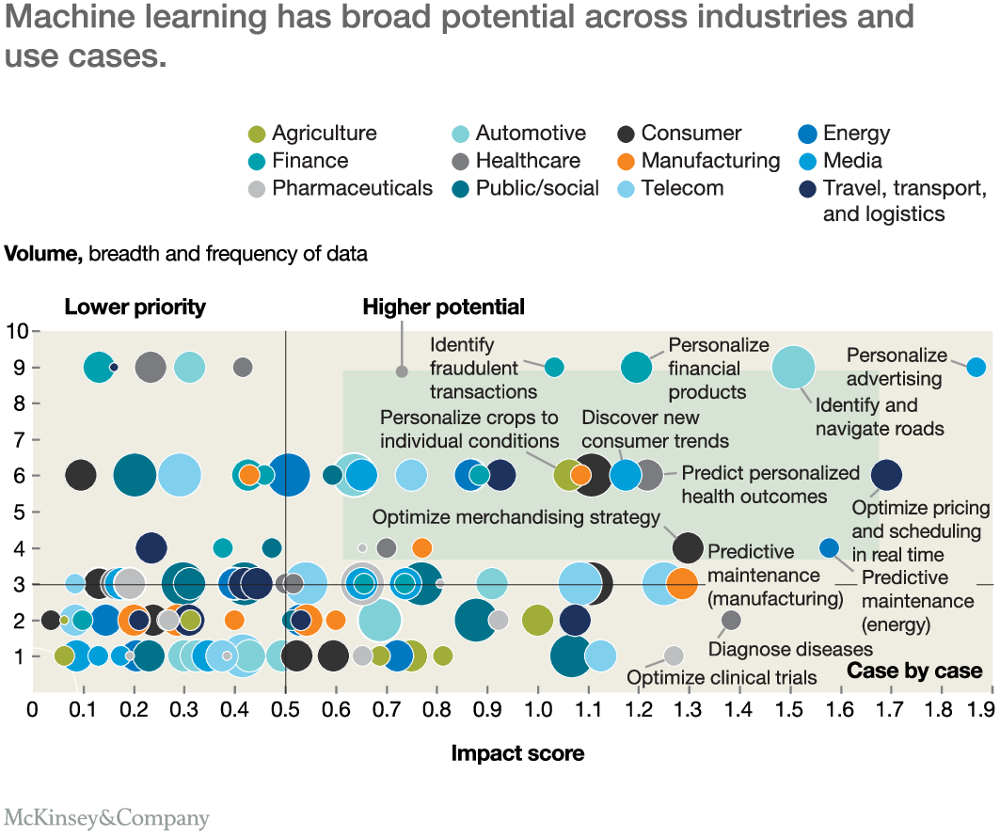

# [데브그라운드 2019] 백정상 구글코리아 - AI 프로젝트 간지나게 잘 진행하는 법

2020.09.20 ~ 2020.09.20 (1hour)

Youtube link -> [https://www.youtube.com/watch?v=BptbmwLHXjU&list=PLVsNizTWUw7HxXDshrgEr5eeHf2cqjtqA](https://www.youtube.com/watch?v=BptbmwLHXjU&list=PLVsNizTWUw7HxXDshrgEr5eeHf2cqjtqA)

### 멋지고 분위기 좋은 팀의 조건

- 세계 최고 수준의 팀을 기반
- 해결하고자 하는 비지니스 문제가 굉장히 크고 아름답고
- 그 문제를 해결하면 생기는 비지니스의 임펙트가 커야 함
- 무조건 성공한다는 확신이 있어야 함
  - 실패 가능성을 최소화해야 함

### 실패하는 머신러닝의 특징

- 비지니스에 대한 이해 부족 -> 비지니스의 목표를 잘 생각해서 적용해라
- 낮은 데이터 품질 -> log에서 누락된 부분이 많고 수준낮은 데이터로 머신러닝을 돌리면 수준낮게 나옴
- 잘못된 머신러닝 사용 -> 머신러닝이 아닌 경우로 해결이 가능하지만 굳이?
- 편견 또는 확증편향 -> 모델이 우선화되면 안됨, 편견이 우선화 되면 통계의 오류에 빠짐
- 부족한 인프라 자원 -> GPU 갯수 500개, 3시간 정도 돌려야 함
- 부실한 계획과 거버넌스 부재 -> 프로젝트를 하다보니 안될꺼 같다는 생각들

### 머신러닝 프로젝트를 실패하지 않으려면

- 풀어야 하는 비지니스의 임팩트가 충분히 크고
- 비지니스 도메인 지식이 충분해야 하고
- 높은 품질의 데이터를 쉽게 획득 가능해야 하고
- 머신러닝이 실제 프로젝트에 도움이 되어야 하고
- 편견이 생기지 않도록 중심을 잡아줄 데이터 사이언티스트가 필요
- 비용 효율적이며 충분한 인프라를 확보
- 충분한 프로젝트 여정에 대한 계획을 기반
- 최고 의사 결정자의 서포트를 충분히 받아 진행해야 함
  - AI 프로젝트는 비용이 큰편
  - 그래서 그건 얼마나 투자해서 얼마나 벌어주는거지?

### 비지니스 케이스 탐색

- Think Big
- 10X Thinking
- 팀 유지비 대비 최소 10배를 더 벌어주는 프로젝트
- 팀 유지비를 대략적으로 산정해보자

### 최초 머신러닝 팀 빌딩

- Product - Product Manager
- Business - Business Analysis
- Data Science - Data Scientist
- Machine Learning - Engineer

### Mckinsey business machine learning

보고서 링크 -> [https://www.mckinsey.com/featured-insights/digital-disruption/whats-now-and-next-in-analytics-ai-and-automation](https://www.mckinsey.com/featured-insights/digital-disruption/whats-now-and-next-in-analytics-ai-and-automation)

오른쪽 위에 있는 케이스로 프로젝트로 진행하면 사업성이 업

### 마치며

나머지 좋은 내용도 강의에 많습니다.

사업성을 정할 때 정말 좋은 강의 같습니다.